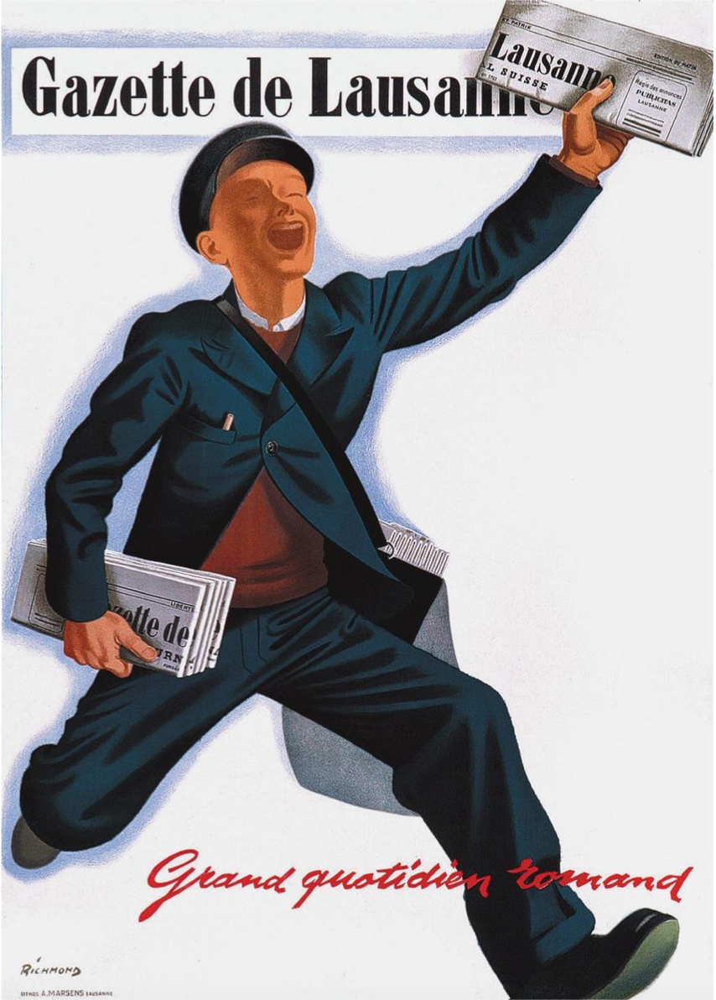
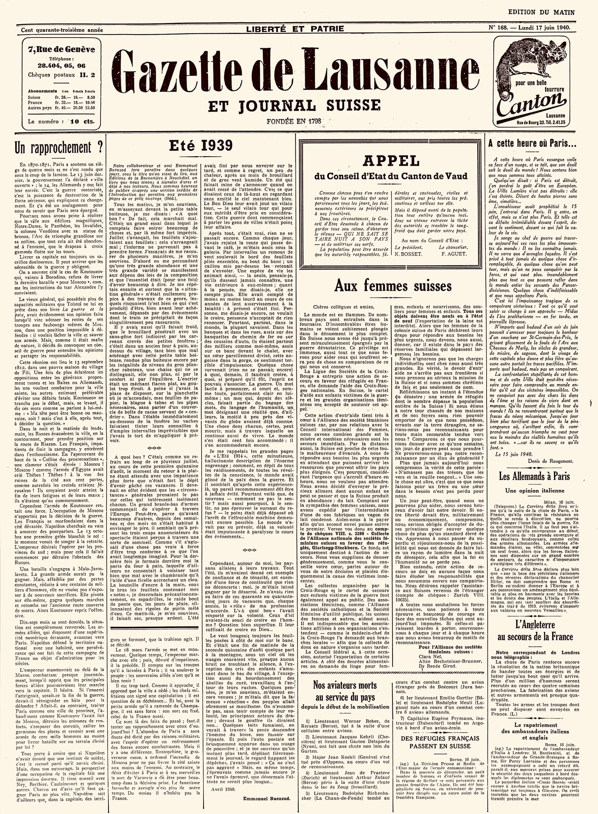
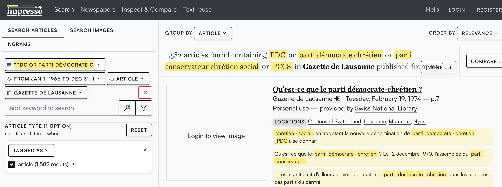
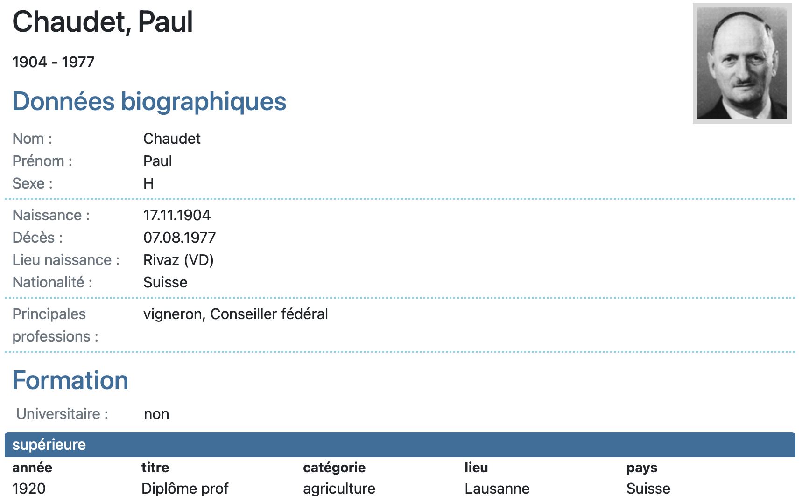

<!DOCTYPE html>
<html lang="en">

  <h1>Les sources utilisées</h1>

    <h2>La Gazette de Lausanne</h2>
    <h>Notre source primaire est La Gazette de Lausanne, une publication emblématique de la presse suisse, dont l'histoire remonte à près de trois siècles. Gabriel-Antoine Miéville, avocat revolutionnaire lausannois, fonda le journal en 1798 sous le nom de Peuple vaudois pendant une période marquée par les révolutions européennes et la chute de l'Ancien Régime.</h>
    <figure class='hero-image'>
    
    <figcaption> Affiche publicitaire de 1943, signée Richmond (Museum für Gestaltung Zürich)</figcaption>
    <figure>

    <figure class='hero-image'>
        
      <figcaption> Extrait du journal La Gazette de Lausanne de 1939.</figcaption>
    </figure> 
    <h>La Gazette de Lausanne, un quotidien de tendance libérale, était un fervent défenseur des idéaux républicains et des principes de la Révolution française. Son contenu était axé sur la politique, l'économie et les affaires internationales, offrant aux lecteurs une perspective éclairée sur les événements majeurs de l'époque. Au fil des décennies, le journal a traversé diverses périodes de changement et d'adaptation, reflétant les transformations sociales, politiques et technologiques de son époque. Il restait avant tout un pilier de l'information politique et sociale en Suisse. En 1991, la Gazette de Lausanne a été intégrée au Journal de Genève. Puis, en 1998, lors de la fusion entre le Journal de Genève et Le Nouveau Quotidien, son nom a été effacé pour donner naissance au Temps. </h>
  

  <h2>Impresso</h2>
  <h>
  <h>Afin de visualiser et d’extraire les donnees de la Gazette de Lausanne des XIXème et XXème siècles, nous avons utilisé la base de données, Impresso, sur laquelle on retrouve les archives numériques de nombreux articles de journaux historiques. Fondé en 2016, l'objectif principal d'Impresso est de numériser et de rendre accessibles de vastes archives de journaux dans le but de faciliter la recherche et l'analyse historique. Impresso a été développé en collaboration de chercheurs en informatique, en histoire et en sciences sociales avec comme partenaires les universités de Lausanne, Zurich et du Luxembourg, et de l’EPF. L’approche méthodologique repose sur l'intégration de techniques de traitement automatique du langage naturel (NLP), de fouille de textes et de méthodes de visualisation de données pour extraire des informations significatives des archives de journau . Cette source nous a ainsi permis de visualiser les articles de la Gazette de Lausanne et de sélectionner seulement ceux qui nous interessait en fonction de leur date de publication et les thèmes évoqués. </h>
  
  <figcaption> Exemple d'utilisation de la base de données Impresso</figcaption>

  <h2>Elites Suisses</h2>
  <h>
  <h>Puisque nous nous sommes interessés aux personnes mentionées dans la Gazette de Lausanne, nous avons utilisé la base de donnees Elites Suisses, publiées par l’Université de Lausanne, pour apporter une valeur bibliographique. Conçue et développée en 2013 par des chercheurs en sciences sociales, cette base de données offre un accès structuré et détaillé sur des personnalités qui ont occupé des postes clés dans différents domaines d'influence au fil de l'histoire suisse. En rassemblant des données biographiques, professionnelles et politiques sur ces individus, Elites Suisses nous a permis d’apporter du contenue et ainsi de mieux analyser les liaisons entre les individus que nous remarquions dans les articles.</h>
  
  <figcaption> Exemple de la base de données Elites Suisses</figcaption>

  <h2>Wikipedia</h2>
  <h>Enfin, Wikipedia nous a permis de completer les bibliogrpahies des personnalités qui n’etaient pas disponibles dans Elites Suisses. Il s’agit d’une encyclopédie en ligne collaborative, fondée le 15 janvier 2001 par Jimmy Wales et Larry Sanger. Son objectif était de créer une ressource universelle et accessible à tous, où les connaissances du monde entier pourraient être partagées et diffusées librement. Son modèle de fonctionnement repose sur la participation volontaire des utilisateurs du monde entier, qui contribuent à la rédaction, à l'édition et à la mise à jour des articles. Malgré les défis liés à la fiabilité et à la neutralité des contenus, Wikipedia est devenue l'une des principales sources d'information en ligne.</h>
  

</html>