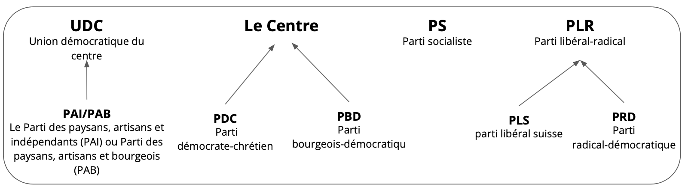
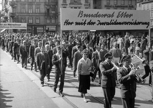
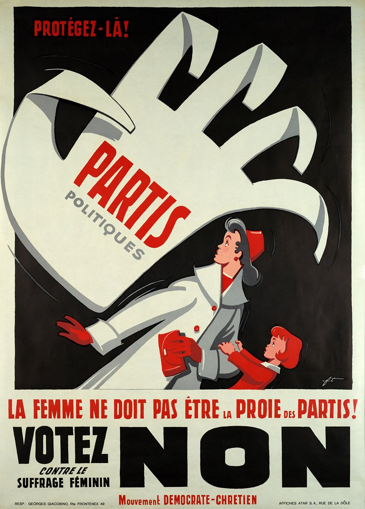
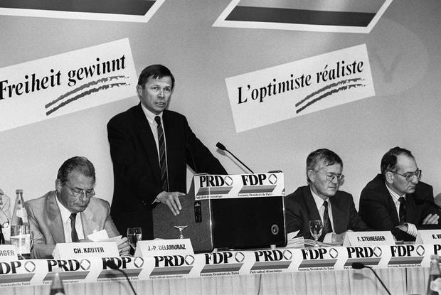
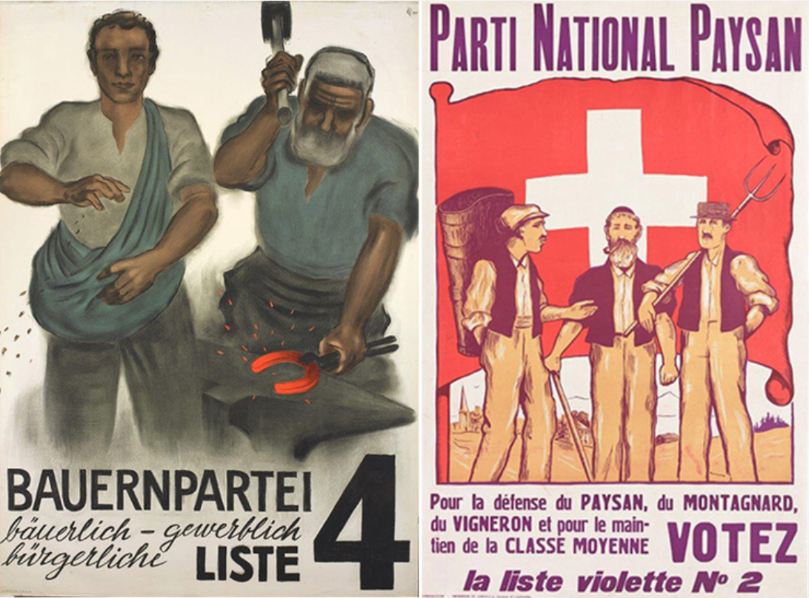
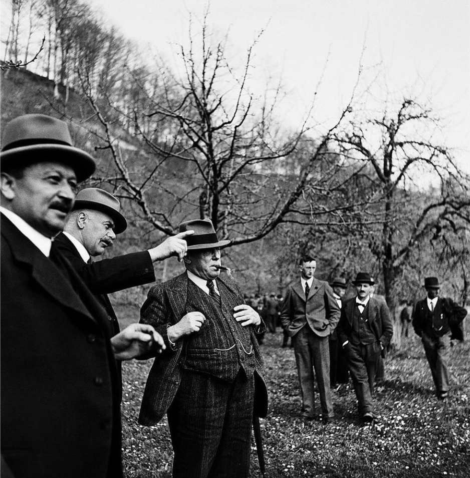

<!DOCTYPE html>
<html lang="en">

  <h1>Rapide historique des partis suisses entre 1890-1980</h1>

  <h> La Suisse, pays démocratique et fédéral, est caractérisée par un système politique multipartite où plusieurs partis politiques coexistent et participent activement à la vie politique du pays. Les principaux partis politiques suisses représentent un large éventail d'idéologies allant de la gauche à la droite de l'échiquier politique. Dans les prochaines lignes, nous allons donner une brève historique des différents partis politiques suisses. </h>

  <figure class="hero-image">
      
      <figcaption>Évolution des Partis Politiques Suisses</figcaption>
  </figure>

<!-- PARTI SOCIALISTE -->

  <h2>Parti Socialiste Suisse (PSS) </h2>
  <h> Le Parti Socialiste Suisse (PSS), fondé en 1888, est l'un des plus anciens partis politiques en Suisse. Il est issu de la fusion de plusieurs organisations socialistes et ouvrières qui luttaient pour les droits des travailleurs et des classes populaires.</h>

  <figure class="hero-image">
    
    <figcaption>Cortège du 1er mai, Archive Sociale Suisse, Zurich </figcaption>
  </figure>

  <h>Le PSS est né dans un contexte de transformations sociales et économiques en Suisse, marqué par l'industrialisation et l'émergence du mouvement ouvrier. Le parti a été fondé sur des idéaux socialistes et marxistes, prônant la lutte des classes, la solidarité internationale et la justice sociale.</h>

  <h>Au fil des décennies, le PSS a été un acteur majeur dans la politique suisse, défendant les droits des travailleurs, les politiques sociales et la redistribution des richesses. Il a été un fervent défenseur du suffrage universel, de la journée de travail de huit heures et d'autres réformes progressistes </h>

<!-- PARTI DEMOCRATIQUE DU CENTRE -->

  <h2>Parti Démocratique du Centre (PDC)</h2>
  <h> Le Parti Démocratique du centre (PDC), originalement appelé Parti Démocratique du Chrétien, est un parti politique suisse fondé en 1912. Il est né de la fusion de plusieurs partis démocrates-chrétiens régionaux et catholiques conservateurs.</h>

  <figure class="hero-image">
    
    <figcaption>Affiche du PDC sur la votation contre le suffrage féminin</figcaption>
  </figure>

  <h>Le PDC a émergé dans un contexte de changements sociaux et politiques en Suisse, où les valeurs chrétiennes et la doctrine sociale de l'Église catholique ont joué un rôle croissant dans le débat politique. Le parti s'est positionné comme un parti de centre-droit, prônant des valeurs chrétiennes telles que la solidarité, la subsidiarité et la justice sociale.</h>

  Au fil des décennies, le PDC a joué un rôle important dans la politique suisse, participant souvent à des coalitions gouvernementales et influençant les politiques sociales et familiales du pays. Le parti a également été un ardent défenseur de la neutralité de la Suisse et de la coopération internationale. </h>

<!-- PARTI LIBERAL RADICAL -->

  <h2>Parti Libéral Radical (PLR)</h2>
  <h> Le Parti libéral suisse, fondé en 1848, était l'un des premiers partis politiques du pays, émergeant à une époque de transition marquante avec l'établissement de la Confédération suisse en tant qu'État fédéral moderne. Principalement constitué de membres issus des milieux bourgeois, intellectuels et économiques, le Parti libéral défendait des idées libérales classiques telles que la liberté individuelle, l'économie de marché et la séparation de l'Église et de l'État. Il a joué un rôle crucial dans l'élaboration des premières constitutions cantonales et fédérales de la Suisse.</h>

  <figure class="hero-image">
      
      <figcaption>Assemblée des délégués du parti radical-démocratique le 24 avril 1993 © KEYSTONE</figcaption>
  </figure>

  <h> Le Parti radical démocratique suisse, fondé en 1881, est issu d'une scission du Parti libéral. Né d'un mouvement plus progressiste au sein du PL, le Parti radical mettait l'accent sur des réformes sociales et politiques audacieuses. Favorable à l'introduction du suffrage universel, à la protection sociale et aux droits des travailleurs, le Parti radical a été un moteur important des réformes démocratiques en Suisse à la fin du 19ème siècle. Il a également joué un rôle de premier plan dans la promotion de la neutralité suisse et dans l'élaboration de la politique étrangère du pays.</h>

  <h> La fusion du Parti libéral et du Parti radical en 1894 a donné naissance au Parti radical suisse (PLR), qui a combiné les idéaux libéraux et progressistes des deux partis. Cette fusion a renforcé la position politique du PLR en Suisse et a élargi sa base électorale. Aujourd'hui, le PLR continue d'incarner les principes du libéralisme classique et du progressisme politique en Suisse.</h>

<!-- UNION DEMOCRATIQUE DU CENTRE -->

  <h2>Union Démocratique du Centre (UDC)</h2>
  <h>L'Union Démocratique du Centre (UDC), fondée en 1971, est le principal parti politique de droite en Suisse. Elle est née de la fusion de plusieurs partis conservateurs et nationalistes, dont le Parti démocratique suisse et le Parti agrarien suisse.</h>

  <figure class="hero-image">
    
    <figcaption>Affiche du PAS, Fribourg </figcaption>
  </figure>

  <h>Le Parti Agrarien Suisse (PAS), fondé en 1917, était initialement centré sur les intérêts des agriculteurs suisses. À une époque où l'agriculture était un pilier économique crucial du pays, le PAS défendait les intérêts des agriculteurs et plaidait en faveur de politiques agricoles protectionnistes et de subventions pour le secteur. Au fil du temps, le PAS a élargi son champ d'action pour inclure des questions de politique sociale, de conservation de l'environnement et de politique étrangère.</h>

  <h>Le Parti Conservateur Suisse (PCS), fondé en 1848, était un parti politique de droite conservatrice qui a joué un rôle important dans la politique suisse au 19ème et au début du 20ème siècle. Le PCS défendait des valeurs traditionnelles telles que la famille, la religion et la souveraineté nationale. Il était généralement en faveur d'une politique économique libérale mais s'opposait souvent aux réformes sociales et politiques progressistes.</h>

  <h>La fusion du Parti Agrarien Suisse et du Parti Conservateur Suisse en 1971 a donné naissance à l'Union Démocratique du Centre (UDC). Cette fusion a uni les intérêts des agriculteurs, des conservateurs et d'autres groupes de droite sous une bannière politique commune. L'UDC a ainsi hérité de la base électorale et des idéaux politiques du PAS et du PCS, combinant les positions nationalistes, conservatrices et populistes de ses prédécesseurs.</h>
  <figure class="hero-image">
      
      <figcaption>Visite en mai 1944 une culture fruitière   à Berthoud avec Rudolf Minger, membre du PAS   © KEYSTONE/Photopress. </figcaption>
  </figure>

