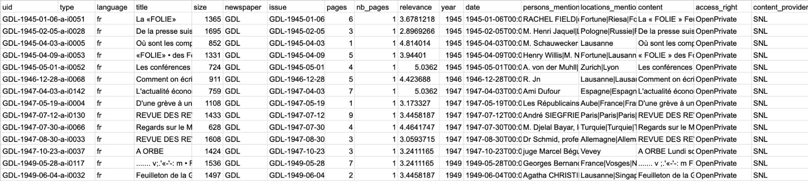

<!DOCTYPE html>
<html lang="en">

  <h1>Méthodologie</h1>

  <h>Cette section décrit le processus méthodologique adopté pour l'étude. Tout d'abord, une analyse historique approfondie a permis de définir les principales questions de recherche à partir de la littérature existante. Ensuite, des requêtes spécifiques ont été formulées pour extraire les articles pertinents. Les données obtenues ont été converties en fichiers CSV, puis intégrées dans une base de données structurée. Un nettoyage minutieux des données a été effectué pour garantir leur qualité et leur cohérence. Enfin, diverses analyses ont été conduites pour interpréter les tendances et les évolutions du paysage politique suisse sur les périodes étudiées.</h>

    

    <h2>Choix de la plage temporelle</h2>
    <h>Pour étudier l'évolution du paysage politique suisse entre 1890 et 1980, nous avons soigneusement sélectionné trois périodes clés : 1890-1910, 1945-1965, et 1966-1980. Ces choix reposent sur plusieurs critères. Tout d'abord, nous voulions nous concentrer sur des périodes marquées par des événements significatifs et bien documentés, mettant en lumière les interactions entre les différents partis politiques. La période de la création du Parti socialiste suisse (PSS) en est un exemple marquant, car elle a constitué un tournant majeur dans l'histoire politique du pays. De plus, notre objectif étant d'analyser la politique suisse, nous avons écarté les périodes autour des deux guerres mondiales, qui sont souvent dominées par des événements internationaux. Enfin, pour comprendre véritablement l'évolution politique, il était essentiel de couvrir une large plage temporelle. Ainsi, les périodes choisies nous permettent de tracer un portrait détaillé et cohérent de l'évolution politique suisse sur près d'un siècle.</h>

    <h2>Création de la base de données</h2>
    <h>Pour créer notre base de données, nous avons d’abord extrait les fichiers pertinents d’Impresso en ciblant les articles de la Gazette de Lausanne liés aux différents partis politiques. Pour cela, nous avons varié les motifs de recherche spécifiant le type de document (article), le journal (la Gazette de Lausanne), la période (1890-1910, 1945-1965 ou 1966-1980) et le parti politique avec ses accronymes respectifs (voir l’expemple de recherche si dessous). Ainsi, pour chaque recherche, nous avons extrait tous les fichiers csv que nous avons ensuite compilé par date en trois bases de données avec des champs tels que le titre, la date de publication, le lieu, les individus cités, la longueur de l'article, etc. </h>

    

<!--

    

-->

    <h2>Analyse des personnalités</h2>
    <h>Nous avons analysé les personnes citées en créant des graphes de connectivité. Un nœud dans un graphe représente une personne mentionnée dans notre base de données. Pour des raisons techniques, nous considérons une personne mentionnée comme un nœud uniquement si la mention contient son nom et prénom.</h>

    

    <h>Deux nœuds sont liés s'ils sont cités dans les mêmes articles. Cette approche nous permet d'obtenir une représentation quantitative des liens entre les personnes mentionnées.
Une fois ces données recueillies, nous avons tenté de lier nos graphes à des bases de données externes. Cette procédure nous a permis d'obtenir des attributs qualifiants pour chacun des nœuds du graphe. Nous avons utilisé Wikipédia ainsi que la base de données Elite Suisse..<h>
    

    <h>L'un des principaux défis du croisement avec des bases de données externes est l'alignement des personnes mentionnées avec celles de la base de données externe. En effet, il est difficile d'accéder au bon objet dans la base de données en se basant uniquement sur le nom et le prénom. Ces bases de données contiennent des homonymes, et les noms des objets peuvent varier en fonction de la langue de Wikipédia.
En raison de cette limitation, l'extraction automatique des attributs n'a pas été entièrement concluante. Nous avons dû compléter manuellement notre base de données pour garantir la précision des informations.
La visualisation ainsi que l’analyse du graphe furent réalisées à l’aide du programme Gephi.</h>

    <h2>Analyse du Langage</h2>
    <h> Afin d’extraire des informations par rapport au type de langage utilisé dans les articles, nous avons effectué du traitement de langage naturel (NLP). En décomposant et en traitant le texte, les techniques de NLP permettent de comprendre le contexte, les nuances et les intentions derrière les mots. Le processus commence par la décomposition de chaque article en mots individuels (tokens). Ensuite, les "stopwords" (mots courants sans signification particulière comme "le", "et", "de") sont supprimés pour affiner l'analyse puisqu’ils sont répétitifs et apportent peu de valeur au langage. Les mots restants sont alors analysés de différentes manières. D’une part, nous avons cherché les mots communs utilisés pour parler des différents partis. Voici un exemple de mots extraits pour le PDC entre 1966-1980. </h>

    

    <h> Nous avons utilisé un modèle d'analyse sentimentale en français, développé par Théophile Blard, basé sur CamemBERT et les Transformers, et entraîné sur des données de critiques de cinéma pour évaluer les sentiments. Ce modèle réalise une classification binaire, déterminant si une phrase est positive ou négative (0 ou 1) et fournissant un score de confiance (entre 0,5 et 1). Il convient de noter que les critiques de cinéma sont fortement influencées par les opinions personnelles et représentent un style d'écriture distinct de celui des articles de journaux, ce qui constitue une limitation du modèle. </h>

    <h> Nous avons effectué des requêtes sur l'ensemble des données en prenant en compte le parti politique, en utilisant des phrases de 20 tokens pour inclure le contexte et déterminer le sentiment. Pour chaque parti politique et pour chaque année, nous avons analysé toutes les phrases de cette période et calculé le ratio du nombre de phrases classées sur le nombre total d'articles pour cette année, afin d'obtenir une mesure de positivité. Pour évaluer la certitude des résultats, nous avons calculé la moyenne des scores de confiance du modèle et déterminé l'intervalle de confiance en utilisant des méthodes statistiques (moyenne et écart-type divisés par la racine carrée du nombre de points de données). </h>

    <h> Nous avons ensuite généré des graphiques pour chaque parti politique par année, incluant les intervalles de confiance et en utilisant un code couleur distinct pour chaque parti afin de maintenir une cohérence visuelle.</h>

