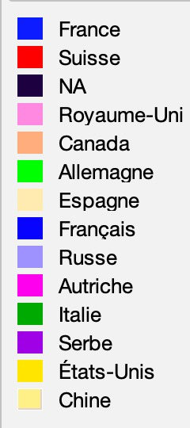
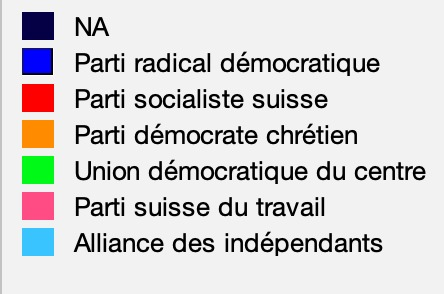
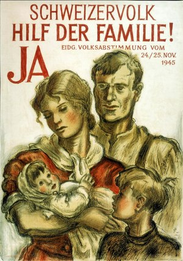
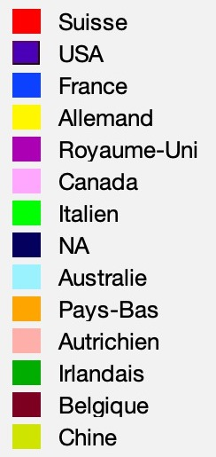
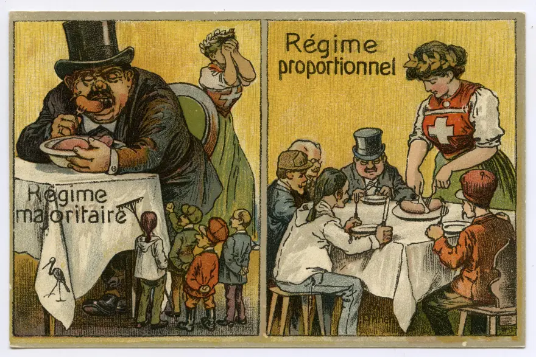

  <h1>Analyses des entités citées dans la Gazeette de Lausanne de 1890 à 1980</h1>

  <h>Les graphes de connectivité que nous avons élaborés offrent une perspective quantitative sur les relations entre les individus mentionnés dans notre base de données. Chaque nœud de ces graphes représente une personne identifiée par son nom et prénom dans les articles analysés. Les connexions entre ces nœuds sont établies lorsque les individus sont cités ensemble dans le même article, reflétant ainsi des liens possibles. Les couleurs des nœuds représentent les nationalités, pour la première et troisième période étudiée, et les partis politiques pour la deuxième. La taille d’un nœud représente le nombre de liens qu’il possède. Cette approche permet de potentiellement visualiser des réseaux d'influence et de collaboration, offrant un aperçu des dynamiques sociales sous-jacentes. De plus, elle facilite l'identification de personnalités centrales et des clusters de personnes fréquemment associées.<h>

  <h2>1890-1910: La Suisse tournée vers l'étranger (France, Uk, Allemagne)</h2>

  

  <h>Le graphe suivant résulte de l’analyse des personnalités politiques pendant la période 1890-1910. Les nœuds représentant les individus se distinguent par des couleurs correspondant à leurs nationalités :(Bleu : France, Rose : Royaume-Uni, Vert : Allemagne,Rouge : Suisse)<h>

  

  <iframe
    src="https://ouestware.gitlab.io/retina/beta/#/graph/?url=https://gist.githubusercontent.com/edouardkoehn/36544c37760d257fbf4cde858db934af/raw/de7a5524a0ba51228938801ffba8d91878ef94d7/network-73c49bf7-de1.gexf"
    frameBorder="0"
    title="1890-1910: Nationality"
    allowFullScreen
  ></iframe>
    

  <h>Ces nationalités représentent les principaux acteurs du graphe, composé pour moitié d'individus suisses et pour moitié d'étrangers. On suppose donc une mention fréquente des nationalités étrangères au sein des mêmes articles de la Gazette de Lausanne discutant de la politique suisse, ce qui montre potentiellement une politique suisse plus tournée vers l’étranger pendant la période. Ceci n’est donc pas surprenant pour la période qui précède la Première Guerre mondiale.</h>

  <h>Avec ce contexte, on tourne notre intérêt vers l’individu qui représente le plus grand nœud (donc le plus lié) dans le graphe, Guillaume II, l’empereur allemand pendant la Première Guerre mondiale. L’individu avec le second plus grand nœud n’est personne d’autre que Félix Faure, le président français (jusqu’à 1899) de cette période. La présence de ces deux nœuds en proximité ainsi que le lien entre eux renforce l’idée de l'intérêt externe de la politique suisse pendant la période.
  On remarque aussi un effet non négligeable de groupement au sein d'individus du même pays. Ceci nous confirme une analyse robuste des données au sein de notre graphe.</h>
  <figure class="hero-image">
      
      <figcaption>L'empereur Guillaume II en 1902</figcaption>
  </figure>

  <h2>1945-1965: La Suisse parle de sa politique intérieure</h2>

 

  <h> Le graphe suivant résulte de l’analyse des personnalités politiques pendant la période 1945-1965. Les nœuds représentant les individus se distinguent par des couleurs correspondant à leurs partis politiques : (Bleu : Parti radical-démocratique, Rose : Parti suisse du travail,Orange : Parti démocrate-chrétien,Vert : Union démocratique du centre, Rouge : Parti socialiste suisse)</h>

  

  <iframe
    src="https://ouestware.gitlab.io/retina/beta/#/graph/?url=https://gist.githubusercontent.com/edouardkoehn/5657ee68f906a1cd7e6810d0b3472ae4/raw/9df1e6d59be3f1fa2c78e0232e6ba47cfc585c51/network-097fe3de-9dc.gexf"
    frameBorder="0"
    title="1945-1965: Political Party"
    allowFullScreen
  ></iframe>
   

  <h> On remarque de grandes différences entre le graphe de cette période et le dernier, notamment la représentation majoritaire des nationalités suisses. Ceci montre un intérêt plus fort de la part de la Gazette de Lausanne pour la politique interne et nous permet donc de filtrer par les partis politiques suisses pour extraire plus d’informations.</h>

  <h> Les acteurs principaux dans ce graphe sont le Parti radical-démocratique, le Parti démocrate-chrétien et le Parti suisse du travail. Avec des orientations et des bases électorales différentes, le PRD et le PDC étaient rivaux dans la compétition électorale, ce qui explique bien leur proximité dans notre graphe. En regardant le groupement en haut à gauche, on peut exclusivement trouver des individus membres du PRD et du PSS (Parti socialiste suisse). Ceci n’est donc pas surprenant grâce à la coopération et à l'abondante soutenance entre les deux partis à l’époque, notamment comme la soutenance de l'introduction de l’assurance sociale AVS, marquant un tournant dans la politique sociale suisse.</h>
  <figure class="hero-image">
      
      <figcaption>Votation populaire 25.11.1945 (BNS)</figcaption>
  </figure>

  <h2>1965-1980: Le monde économique entre dans le débat publique et le soft power des USA</h2>

Le graphe suivant résulte de l’analyse des personnalités politiques pendant la période 1965-1980. Les nœuds représentant les individus se distinguent par des couleurs correspondant à leurs nationalités :
(Bleu : France, Rouge : Suisse)

  <iframe
    src="https://ouestware.gitlab.io/retina/beta/#/graph/?url=https://gist.githubusercontent.com/edouardkoehn/87dfad65854afc8035d5af764e334cb7/raw/c893417582f89e1f50ac50936caa40055ac44a8b/network-fb7beb90-255.gexf"
    frameBorder="0"
    title="1966-1980: Nationality"
    allowFullScreen
  ></iframe>
  

  </h> Dans un premier cas, on s'intéresse au groupe en haut à gauche. On peut distinguer les noms de compagnies américaines, ce qui peut (faussement) donner l’impression que la Gazette de Lausanne avait mentionné ceux-là fréquemment au sein des articles politiques. Ceci peut donc donner une vision égarée de la politique suisse pendant la période aux lecteurs. Avec un regard plus attentif, on réalise que ceci est un effet indésirable, dû à la lecture de la page financière par notre algorithme. On décide donc d’ignorer ce groupement pendant notre analyse de graphe.</h>  

  <h> En tournant notre attention vers l’autre groupement, on peut distinguer une différence plus subtile par rapport au dernier graphe. Tout en étant majoritairement suisse, avec une apparence minoritaire française, les trois principaux acteurs sont le PRD, le PSS et le PDC, correspondant donc aux trois partis possédant le plus de sièges au Conseil national et le plus d’influence dans les cantons suisses pendant cette période.

  <figure class="hero-image">
      
      <figcaption>Entre la fin du 19e et le début du 20e siècle, le système électoral fait débat en Suisse. Cette carte postale de 1918 montre clairement de quel côté penche le coeur de son auteur. Schweizerisches Sozialarchiv</figcaption>
  </figure>

  <h>
  Malgré leurs différences idéologiques fondamentales, les membres des trois partis sont tous représentés équitablement en taille et en proximité au sein du même groupe. Ceci peut potentiellement être une conséquence de la politique suisse pendant cette période, caractérisée par une relative stabilité et un consensus politique fort, avec un système politique qui favorise la coopération entre les partis. Un exemple de ceci est présent dans la pratique d’un système de concordance entre les principaux partis politiques. </h>

