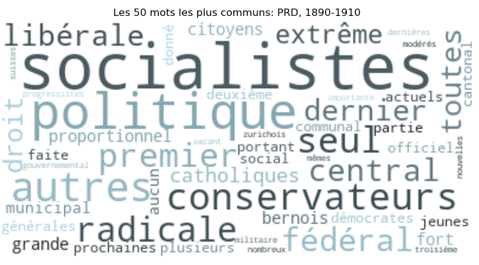
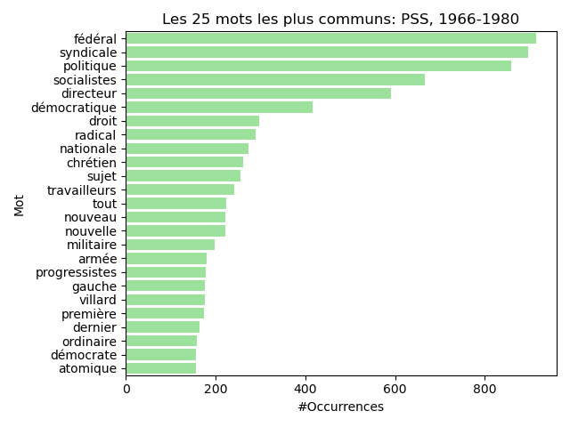

  <h1>Analyse du langage utilisé pour la description des partis politiques dans la Gazette de Lausanne entre 1890 et 1980</h1>

  <h>Dans cette section, nous analysons comment la Gazette de Lausanne a dépeint les partis politiques entre 1890 et 1980, soulevant ainsi les nuances et les évolutions du discours journalistique au fil des décennies. Pour réaliser cette analyse, nous avons utilisé une modèle de language pour l'analyse sentimentale. Malgré les progrès récents de méthodes d'analyse de language, il est important de mentionner le fait que ces modèles on des biais intrinsèques et qu'ils n'ont pas été entrainé sur des textes historiques. </h>

<!-- PERIODE 1890-1910 -->

  <h2>1890-1910: Émergence et Consolidation des Partis Socialistes, Radicaux Démocratiques, et Catholiques Populaires</h2>

<!-- PARTI SOCIALISTE -->

  <h3>Parti Socialiste Suisse</h3>

  <h>Le PSS, fondé en 1888, a rapidement gagné en popularité parmi les ouvriers et les classes laborieuses. Cette période a été caractérisée par une industrialisation croissante et des conditions de travail souvent ardues, ce qui a conduit de nombreux travailleurs à considérer le PSS comme un défenseur de leurs droits et de leurs intérêts. En revanche, les élites économiques et politiques, ainsi que les groupes conservateurs, avaient un regard méfiant et hostile du PSS. Ils redoutaient que les idéaux socialistes, tels que la redistribution des richesses et les droits des travailleurs, ne menacent l'ordre social et économique établi.</h>

  

  <h>Ces opinions divergentes peuvent expliquer le petit interval de confiance dans l'analyse des sentiments, indication positive de la précision de l’analyse, ainsi que la positivité moyenne avoisinant 0,4. Le parti étant encore nouveau, il faisait face à une résistance considérable de la part de l'élite conservatrice suisse. </h>

   
   

<!-- PARTI RADICAL DEMOCRATIQUE -->

  <h3>Parti Radical Démocratique</h3>

  <h>Entre 1890 et 1910, le Parti radical-démocratique jouissait d'une position assez favorable parmi le peuple suisse, notamment grâce à son rôle dans la modernisation et l'industrialisation du pays. Ceci est visible sur le graphe ci dessous. Son influence était particulièrement notable au niveau fédéral et dans les cantons urbanisés comme celui de Berne et de Zurich. De nombreux membres du Conseil fédéral (le gouvernement suisse) étaient issus du PRD, ce qui leur permettait d'avoir une influence considérable sur la politique nationale.</h>

  

  <h>L'observation est renforcée par la fréquence d'utilisation des termes courants tels que "socialiste" et "conservateur". Historiquement, ce constat est confirmé avec l'opposition croissante entre les partis conservateurs et socialistes, qui commencent à gagner en influence au cours de cette période. </h>

   
   

  <h>On remarque un grand niveau de positivité pour l’année 1890. Cependant, l’intervalle de confiance est autour de 50% ce qui indique que notre modèle est très incertain de ses choix. </h>

<!-- PARTI CATHOLIQUE POPULAIRE -->

  <h3>Parti Catholique Populaire</h3>

  <h>Issu du mouvement catholique social, la Parti Catholique Populaire représente les intérêts des catholiques conservateurs et des populations rurales, tout en défendant des valeurs traditionnelles dans un contexte de modernisation croissante de la société suisse.</h>

 

  <h>Il est important de noter ici que si la barre de positivité est à 1, cela indique que tous les articles dans notre dataset pour l’année sont considérés comme positifs. Cela veut certainement dire que le nombre d’articles pour l’année en question doit être très petit, et donc pas représentatif de l’opinion général de l’époque. On peut clairement voir ici aussi avec le nombre d’années citées que notre dataset pour le Parti Populaire Catholique pour cette période est très limité. Il nous est donc difficile d’en tirer des conclusions. </h>

  

  <h>Ce qui peut être confirmé par le WordCloud ci-dessous est la base de soutien du parti. Il était principalement soutenu par les populations catholiques de Suisse, surtout dans les cantons à majorité catholique comme le Valais, Fribourg, et le Tessin. Le parti était une force conservatrice qui défendait les valeurs traditionnelles et religieuses. Ce serait possible que les ethnicités mentionnées soient représentées par des petites minorités d’immigrants politiques en suisse qui seraient potentiellement protégés par des communautés de même religion, et donc reliés au parti. A noter aussi que le nombre d’occurrences maximale est moins de 140, qui est un petit nombre par rapport au cas précédent qui donnait plus de 2’000 occurrences.</h>

   
   

<!-- PERIODE 1945-1965 -->

  <h2>1945-1965: Évolution Politique et Changements Sociaux</h2>

<!-- PARTI SOCIALISTE -->

  <h3>Parti Socialiste Suisse</h3>

  <h>Nous pouvons voir dans le graphe de positivité et dans l’histogramme que le nombre d’articles analysés est encore une fois très limité. Nous pouvons potentiellement en conclure que s’ils sont mentionnés beaucoup moins souvent et que leur score de positivité ait aussi décliné que leur influence soit peut être moins puissante.  </h>

  

  <h>Les mots intéressants dans le WordCloud sont les mots jurassiens et genevois. La région du Jura, historiquement francophone et catholique, a été marquée par des tensions avec le canton de Berne, majoritairement germanophone et protestant. Le PSS a soutenu les mouvements autonomistes jurassiens qui cherchaient une plus grande indépendance vis-à-vis de Berne. Genève, avec sa population cosmopolite et ses traditions de tolérance et de progressisme, a été un bastion du PSS. Le PSS a souvent eu une représentation significative au Grand Conseil de Genève (parlement cantonal), et leurs membres ont régulièrement été élus au Conseil d'État (gouvernement cantonal). </h>

   
   

<!-- PARTI RADICAL DEMOCRATIQUE -->

  <h3>Parti Radical Démocratique</h3>

  <h>Le Parti Radical-Démocratique a joué un rôle significatif dans la politique suisse de l'après-guerre. Il se concentre sur la reconstruction et le développement économique, notamment comme la soutenance de l'introduction de l’assurance sociale AVS, marquant un tournant dans la politique sociale suisse. </h>

  

  <h>En analysant ce graphe, on trouve une moyenne de positivité significativement plus haute que le reste des partis politiques à travers les périodes analysées. Ainsi, nous pouvons faire l'hypothèse que les articles de la Gazette de Lausanne invoquaient un sentiment relativement positif du PRD pendant cette période.</h>

   
   

<!-- PARTI CATHOLIQUE POPULAIRE -->

  <h3>Parti Catholique Populaire</h3>

  <h>Nous maintenons le fait que les scores de positivité élevés ne peuvent pas être représentatif du sentiment de la population, dû au fait que le nombre d’articles qui mentionnent ce parti politique est trop restreint. Nous voyons aussi de larges intervalles de confiance qui attestent de ce fait.</h>

  

  <h>Le contexte historique des mots les plus communs associé au parti nous explique que le canton de Fribourg, étant à majorité catholique, a toujours été un bastion du Parti Catholique Populaire. Les relations entre le PCP et le Parti Socialiste Suisse (PSS) étaient souvent marquées par une opposition idéologique, notamment sur des questions de laïcité, de politique sociale et économique. Ceci peut expliquer pourquoi les socialistes et les catholiques étaient souvent mentionnés dans la même phrase, probablement en mettant en opposition l’idéologie de l’un avec l’autre. Finalement, en 1959, l'introduction du soi-disant, "formule magique”, a officialisé une répartition des sièges au Conseil fédéral entre les principaux partis, y compris le PCP. Cela a garanti une représentation équilibrée des différentes forces politiques du pays au niveau fédéral, incluant les catholiques.</h>

   
   

<!-- PARTI PAYSANS, ARTISANS, BOURGEOIS -->

  <h3>Parti des Paysans, Artisans, et Bourgeois</h3>

  <h>En 1945, le parti des Paysans, Artisans et Bourgeois, également connu sous le nom de Parti paysan suisse (PPS), se trouve à un moment crucial de son histoire. Fondé en 1917, le parti représente les intérêts des agriculteurs, des artisans et des classes moyennes urbaines. À cette époque, le PPS est devenu un acteur politique influent, défendant des politiques favorables à l'agriculture et à l'industrie locale, tout en prônant une vision conservatrice de la société suisse. Les opposants majeures du PAB étaient les socialistes, et leur alliés naturels le PRD. Ceci explique les hautes occurrences des mots “socialistes” et “radicaux” autour des références au PAB. Nous voyons aussi une forte base de soutien autour de Berne et les régions vaudoises. Sans plus d’articles, nous ne pouvons pas tirer de vrai conclusion sur le graphe de positivité. </h>

  

  <h> Par contre, en excluant les années 1947 et 1963, qui ne sont pas fiables, comme témoignent leurs grandes intervalles de confiance, nous pouvons voir une moyenne de positivité autour de 0.6. Ceci est relativement élevé. Cela est compatible avec le contexte qui nous décrit une base électorale solide dans les zones rurales de Vaud, où le PAB représentait les intérêts des agriculteurs, des artisans et des petites entreprises. Le parti y trouvait un soutien important grâce à sa défense des valeurs traditionnelles et de l'économie rurale. 

   
   

<!-- PERIODE 1966-1980 -->

  <h2>1966-1980: Renaissance et Réalignements Politiques</h2>

<!-- PARTI SOCIALISTE -->

  <h3>Parti Socialiste Suisse</h3>

  <h>Entre 1966 et 1980, le Parti Socialiste Suisse a continué à être une force politique majeure en Suisse, jouant un rôle significatif au niveau fédéral et entretenant des relations étroites avec les syndicats. Ils ont travaillé à promouvoir des politiques progressistes et ont collaboré avec d'autres socialistes pour faire avancer leur agenda de justice sociale. Le PSS a maintenu une présence active et influente dans la politique suisse, soutenant les droits des travailleurs et cherchant à réduire les inégalités sociales. Par contre, nous observons un niveau de positivité assez stable, mais réduite, autour de 0.3. Nous voyons des intervalles de confiance larges, et donc les résultats sont moins fiables. </h>

  

  <h>Les mots intéressants dans le WordCloud sont les mots jurassiens et genevois. La région du Jura, historiquement francophone et catholique, a été marquée par des tensions avec le canton de Berne, majoritairement germanophone et protestant. Le PSS a soutenu les mouvements autonomistes jurassiens qui cherchaient une plus grande indépendance vis-à-vis de Berne. Genève, avec sa population cosmopolite et ses traditions de tolérance et de progressisme, a été un bastion du PSS. Le PSS a souvent eu une représentation significative au Grand Conseil de Genève (parlement cantonal), et leurs membres ont régulièrement été élus au Conseil d'État (gouvernement cantonal). </h>

   
   

<!-- PARTI RADICAL DEMOCRATIQUE -->

  <h3>Parti Radical Démocratique</h3>

  <h>Pendant la période 1966-1890, Le PRD collabore avec le PSS sur certaines réformes sociales telles que l'amélioration des assurances sociales et la politique de logement, ceci peut potentiellement expliquer l’apparition du mot socialistes en plusieurs occurrences dans l'histogramme. Il est par contre important de noter que des divergences persistent sur la politique économique, le PRD privilégiant une approche plus libérale et favorable au marché par rapport aux positions plus interventionnistes des socialistes.</h>

  

  <h> En général, il y a une baisse du sentiment positif au sein des articles de la gazette de lausanne en relation avec le PRD par rapport à la période 1945-1965, avec une moyenne de 0.3, ceci peut potentiellement être dû aux relations avec les socialistes qui oscillent entre coopération pragmatique et rivalité idéologique, reflétant les dynamiques complexes du paysage politique suisse.</h>

   
   

<!-- PARTI DEMOCRATE CHRETIEN -->

  <h3>Parti Démocrate-Chrétien</h3>

  <h>Nous observons sur le graphe de positivité que le parti démocrate-chrétien est vu favorablement dans la période de 1966 à 1980. La moyenne est plus élevée que 0.5, et les intervalles de confiance sont petits, montrant des résultats précis. Vu que le nombre d’occurrences de mots peuvent être plus élevés que 5000, nous voyons que les résultats sont basés sur un grand nombre de données. </h>

  

  <h>Le PDC a eu une représentation continue au Conseil fédéral pendant cette période. Des figures marquantes comme Roger Bonvin (1962-1973), Kurt Furgler (1972-1986), et Hans Hürlimann (1974-1982) ont contribué à maintenir l'influence du parti au sein du gouvernement. Leurs contributions ont été cruciales dans la formulation de politiques nationales. Le parti jouait souvent le rôle de médiateur entre les socialistes et les radicaux, comme le prédit le WordCloud.</h>

   
   

<!-- UNION DEMOCRATIQUE DU CENTRE -->

  <h3>Union Démocratique du Centre</h3>

  <h>L'année 1971 marque un tournant important pour l'Union Démocratique du Centre, car elle résulte de la fusion de l'Union des Paysans, Artisans et Indépendants (UPAI) et du Parti démocratique. Cette fusion a renforcé la position de l'UDC en tant que force politique majeure en Suisse. On remarque que la plus grande positivité est en 1971. Plusieurs articles parlent de “fusion” et de “création” de l’UDC. Le modèle utilisé considère ces concepts comme étant positifs. </h>

  

  <h>L'UDC partageait de nombreuses valeurs conservatrices avec les milieux chrétiens, notamment sur des questions de famille, de morale et de traditions. Le parti a souvent soutenu des politiques visant à protéger les valeurs familiales et traditionnelles, ce qui a trouvé un écho favorable parmi les chrétiens conservateurs.</h>

   
   

