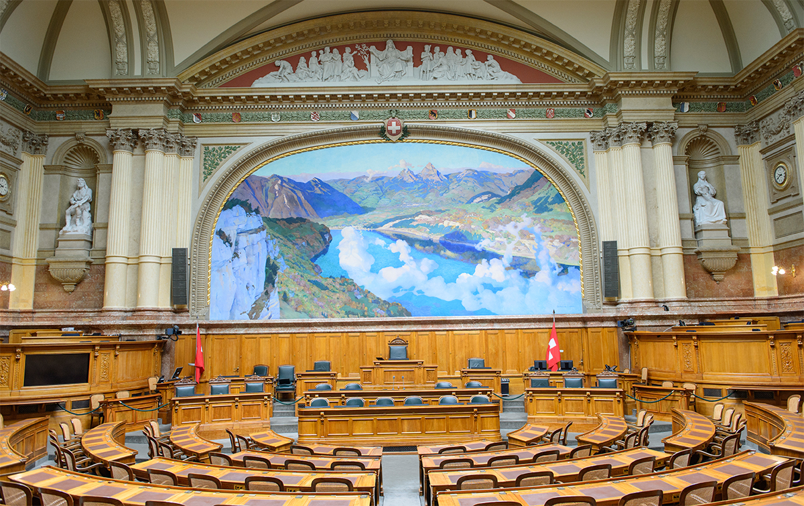

<html>

  <h1>Lausanne Time Machine</h1>
  <h2>Évolution du paysage politique suisse entre 1890 et 1980</h2>

  <figure>
   
   <figcaption>Salle du conseil national, Bern</figcaption>
   <figure>

  <h3> Le projet </h3>
  <h>La presse écrite joue un rôle essentiel au cœur de nos sociétés contemporaines, et même avec l'avènement du numérique, elle reste solidement ancrée en Suisse. D'un point de vue historique, la presse offre une richesse d'informations fascinante. Elle nous ouvre les portes vers une multitude de perspectives sur des événements, des personnalités et des thèmes. Contrairement aux ouvrages académiques qui présentent souvent un seul point de vue, la presse offre une diversité d'opinions qui est cruciale pour saisir pleinement la complexité d'un événement. Ce qui rend cette source encore plus précieuse, c'est le travail méticuleux des archivistes qui nous permet d'accéder à des décennies d'archives. Cela crée une véritable chronique historique, une rareté dans le domaine de l'histoire. De plus, grâce à la numérisation des archives, les historiens peuvent désormais appliquer des méthodes quantitatives pour analyser et interpréter l'histoire.En considérant ces aspects, nous sommes convaincus que la presse constitue une ressource inestimable pour étudier l'évolution d'une société au fil du temps.
  
  Dans le cadre de notre projet, nous avons exploré l'évolution du paysage politique suisse à travers le prisme de la presse écrite. Plutôt que de simplement relever les occurrences d'événements historiques, nous avons adopté une approche quantitative pour analyser les thèmes abordés par la presse à différentes époques. Cette approche nous permet de comprendre quels sujets politiques dominaient les pages des journaux et comment le paysage politique suisse a évolué au fil des ans. </h>

<h3>Notre Sujet</h3>
  <h>En 1848, la Suisse a tracé les contours de sa modernité en adoptant sa première Constitution fédérale. Cette année-là a marqué un tournant majeur dans l'histoire du pays, métamorphosant la Confédération d'une alliance informelle de cantons en un État fédéral centralisé. Cette refonte institutionnelle a favorisé une cohésion nationale renforcée tout en préservant la souveraineté des cantons.

  La Constitution de 1848 a introduit un système politique bicaméral avec le Conseil national, représentant la population, et le Conseil des États, représentant les cantons. S'inspirant du modèle des États-Unis, ce cadre fédéraliste a permis de concilier les intérêts variés des différentes régions et cultures suisses, contribuant ainsi à la stabilité et à l'unité nationale. A l'aide de la sciences de données, nous allons explorer le payasage politique à travers le regarde de la presse historique.</h>

<figure>
  
  <figcaption> Constitution fédérale, Lithographie de Caspar Studer, Winterthour, imprimée par Johann Jakob Ulrich à Zurich, 1848</figcaption>
<figure>

  <h>Nous avons adopté deux perspectives d'analyse distinctes. La première est une approche macro, où nous avons effectué une analyse des réseaux pour comprendre les événements mentionnés à travers différentes périodes. La seconde est une approche micro, où nous avons étudié le langage employé dans les articles de presse en relation avec les partis politiques en utilisant des modèles de langage avancés </h>

</html>